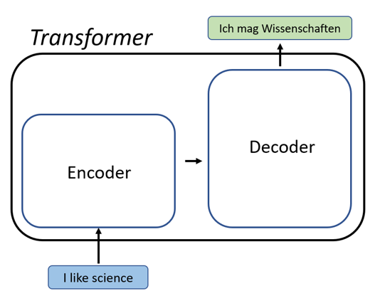
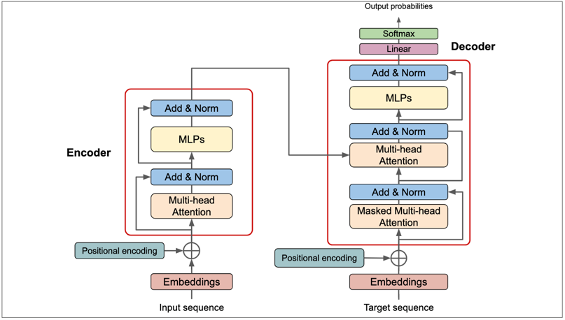
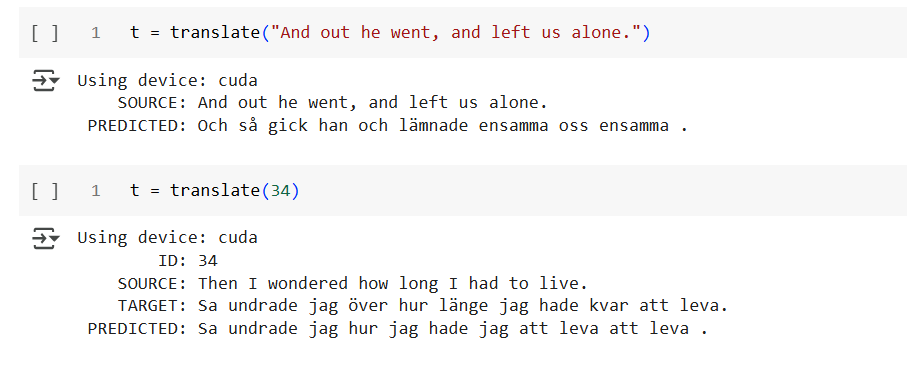

# **_Transformers in LLMs_**

                                   **_Attention is all you need_**

The paper which started to revolutionise the field of Natural Language Processing (NLP) and Deep Learning. 
This innovative approach in NLP was first introduced by Vaswani et al in 2017 in their paper "Attention is all you need". 
This has become the backbone of modern large language models (LLMs). 
What’s cool is that the impact of transformers goes beyond NLP. 
They've inspired models like Vision Transformers, which apply the same concept to images, opening new possibilities in computer vision.

Unlike the traditional models like RNNs and LSTMs which process the sequence step-by-step, transformers process the sequence 
simultaneously, improving efficiency and enabling them to handle larger input.

**Core components of Transformer**

**1. Encoder and Decoder:**

- Transformers typically use an encoder-decoder structure.

- **_Encoder:_** Encodes the input sequence into a context-rich representation using multiple layers of attention mechanisms.

- **_Decoder:_** Generates output from the encoded representation, paying attention to the encoder output and previous decoder outputs.

_Fig 1. Encoder-Decoder of the Transformer_

**1.1 Input Embedding:**

- The sequence must be numerically converted so that the machine can understand it. Hence we are embedding it.
- From the pre trained model, the words with similar meanings are closer in the high dimensional space.
- For example, dog and cat are closer than cat and human

 

_Fig 2. Word Embedding Visualization (Borisov, 2020)_

**1.2 Positional Encoding:**

- *This is a dog* and *is This dog a* are not same sentences.
- But when the model processes this, it considers to be the same sentence. This will be an issue during the translation and other tasks.
- In order for the machine to understand the sequence of strings, we add them together with a unique vector alternatively which is determined by the below formula.

$$
\mathrm{PE}(pos, 2i) = \sin \left( \frac{pos}{10000^{2i/d{\mathrm{model}}}} \right)
$$

$$
\mathrm{PE}(pos, 2i+1) = \cos \left( \frac{pos}{10000^{2i/d{\mathrm{model}}}} \right)
$$

- This creates a smooth, periodic pattern that helps the model capture both short-term and long-term dependencies between words, enabling it to understand context and relationships within the sentence.

By combining word embeddings with positional encodings, we give the transformer a complete understanding of the input sequence: both the meaning of individual words and their order within the sentence.

**2. Multi-Head Attention:**

- The below image shows Multi-Head Attention, using Query, Key, and Values to process translations like "cat" from English to French. The attention mechanism selects the most relevant translation of the Query ("cat") by comparing Keys (in English) to the Query and fetching the relevant Values (in French).
- In the decoder, a mask ensures the output is generated sequentially, preventing future word predictions. Multi-Head Attention captures multiple possible translations simultaneously, improving accuracy. This is *self-attenction mechanism*.
- When multiple self-attention mechanisms are added together, it is called *multi-head attention*, where each self-attention mechanism is denoted as heads and all the heads work parallelly.

_Fig 3. (left) Scaled Dot-Product Attention. (right) Multi-Head Attention consists of several attention layers running in parallel.(Vaswani et al., 2017)_

**_Combining all the components together we get a transformer_**

_Fig 4. Transformer Architecture (Vaswani et al., 2017)_

Recalling the working again, let us assume we are translating a sentence from one language to the other and see how the transformer replies to it. The input and target sequences are fed into the encoder and decoder respectively, where the sequence is numerically embedded and positionally encoded. Multi-head attention mechanisms are applied to both the encoder and decoder, with the decoder using a mask to prevent attending to future words. The encoder-decoder attention utilises, the encoded input sequence and the masked target sequence generates a probability distribution over possible target words. The word with the highest probability is selected as the next word in the output sequence. This process continues iteratively until the decoder generates an "end" token, marking the completion of the process.

Next, let us explore how effectively we can use the transformer models. To demonstrate this, we implement and evaluate 3 distinct use cases. For the code, check out the attached files.

**1. Reversing a word**

In this project, we will use our transformer model to reverse a given word. This is done by training the model for 3 epochs with the randomly generated strings and their reversed counterparts. By doing this, the model will learn to map the input words to its reversed versions. By adjusting the vocabulary size to accommodate letters and training the model on this task, we can observe how the Transformer architecture learns to process and generate sequences, even in this simplified scenario. AAlso we will visualize the attention weights to gain insights into how the model attends to different parts of the input sequence during the reversal process, where the color intensity reveals the strength of the attention. Brighter colors indicate stronger attention. This use case provides a basic understanding of Transformer model training and their ability to learn and generate sequences. (Etienne, 2024)

_Fig 5. Reversing a word_

_Fig 6. Attention weights for the reversed word_

**2. Transformer - Training Loss Visualization**

In machine learning, visualizing the loss function during training is essential for assessing a model's performance. By tracking down how the loss changes over the time, we can monitor the learning process. A steadily decreasing loss generally indicates that the model is improving, while an increasing loss indicates potential issues like overfitting or problems with the learning process.

In this project, we generate random sequences of source and target sentences and map them to each other randomly. The model is trained in such a way that it predicts the relative target sequence. However, our primary focus is on visualizing the training loss of the model. By tracking how the loss changes over time, we can assess the model's learning progress, identify potential issues like overfitting or learning rate problems, and gain insights into the effectiveness of the training process. From the below graph, we could see for 100 epochs, the losses have been decreasing steadily indicating that the model is learning effectively and improving its ability to predict the target sequences. (Sarkar, 2023)

_Fig 7. Training loss visualization_

**3. Translation - English to Swedish**

In this project, we will try to translate a phrase or sentence from English to Swedish. For the training, we will use opus books dataset from the Huggingface which contains sentences in English with its related Swedish translation. The model is trained with the source (English) and target (Swedish) sentences, while producing an output called predicted sentence. After training the model for around 30 epochs, we could observe how the predicted sentence improves with each epoch. Post-training, we validate the model using a separate set of 10 sentences. Finally the model is then tested on new, unseen English sentences to evaluate its translation accuracy. To monitor the model's learning process, we'll utilize wandb.ai to track and visualize both the training and validation losses. This allows us to gain insights into the model's progress and identify potential areas for improvement. (Singh, 2024 and Jamil, 2023) 

_Fig 8. English-to-Swedish Translation results on test data_
 

**References:**

1. Vaswani, A. et al. (2017), "Attention Is All You Need", Advances in Neural Information Processing Systems (NIPS).
2. Etienne, B. (2024), "A Complete Guide to Write Your Own Transformers", Towards Data Science.
3. Sarkar, A. (2023). "Build Your Own Transformer from Scratch Using PyTorch", Towards Data Science.
4. Singh, B. (2024). "Transformer from Scratch Using PyTorch", Medium
5. Borisov, O. (2020), "Word Embeddings: Intuition behind the vector representation of the words", Towards Data Science. 
6. Jamil, U. [@umarjamilai]. (2023), Coding a Transformer from scratch on PyTorch, with full explanation, training and inference, YouTube, 25 May.